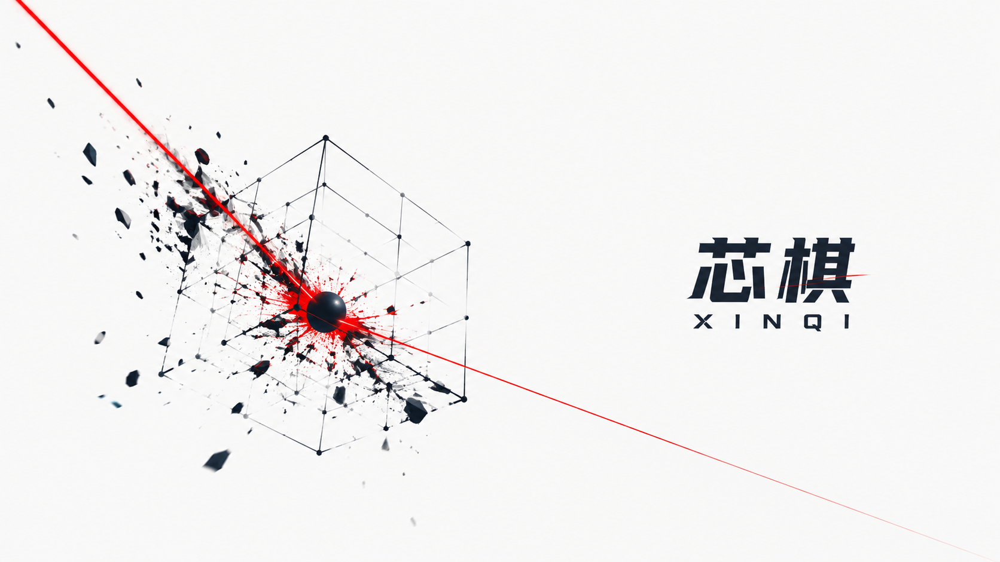

<p align="center">
  
</p>

<h1 align="center">芯棋 · XinQi</h1>

<p align="center">
  <strong>全新三维棋类 — N×N×N 格点棋盘，三截面独立提子 + 内芯挪子</strong>
  <br>
  <em>一个崭新的棋类宇宙，不是变体，是原创。</em>
</p>

<p align="center">
  <code>规则简单 · 深度无穷</code>
  <br>
  <em>五分钟学会，一辈子下不完</em>
</p>

<p align="center">
  <table align="center">
    <tr>
      <td align="center"><b>🖥️ XinQiServer</b></td>
      <td align="center"><b>🌐 XinQiRoomServer</b></td>
    </tr>
    <tr>
      <td align="center">本地对弈 · AI 对战 · 棋谱回放<br>双击运行，浏览器即玩</td>
      <td align="center">多人在线 · 4 位房间码 · 好友秒入<br>手机电脑均可 · 局域网或 ngrok</td>
    </tr>
  </table>
</p>

<p align="center">
  
  
  
  
  
  
  
  
</p>

<br>

---

## 🇨🇳 中文

### 芯棋是什么？

芯棋不是围棋的三维变体——它是一套**从零设计的原创棋类规则**，在 **N×N×N 三维立体格点**上展开。灵感源于围棋的"气"的概念，但演化出了完全不同的攻防体系和胜利路径。

**一句话概括：在三维棋盘上，你的棋子可以被包围、被提走，也可以"破壳而出"。**

#### 四大特色

|  |  |  |
|---|---|---|
| 🎲 **三维棋盘** | 🤏 **规则两分钟** | 🧠 **AI 就绪** | 🌐 **在线对战** |
| 默认 5×5×5 立体格点，N=5~9 可选 | 落子 + 挪子，两种操作，一种执着 | 内置 MCTS + Python 训练管线，社区驱动 | 房间服务器 + 4 位码入局，瓜熟蒂落 |
| 125 个格点构筑立体战场 | 无长考，上手即战 | 从 Rollout 启发式到 AlphaZero 皆可 | 桌面手机均可，同局域网或 ngrok 分享 |

#### 更多亮点

- 🧊 **三截面提子** — X/Y/Z 截面各自算气，任一截面无气即提，攻防思维迥异于平面棋类
- ⚡ **内芯挪子** — 被六面合围的"内芯"可以破壳移位，原址变成永久"伤疤"
- 🏆 **双重胜利** — 内芯侵入（踏入对手伤疤）或清台终局（对手无内芯），两种截然不同的战略路径
- 🌐 **中英双语** — 一键切换界面语言
- 🌗 **亮暗主题** — 护眼暗色 + 优雅亮色，随光而变

---

### 快速规则

棋盘是 **N×N×N 立体格点**（默认 5×5×5 = 125 格）。黑白轮流落子，黑先。

**每手两种操作（二选一）：**

| 操作 | 说明 |
|------|------|
| **落子** 🪨 | 在空格放己方棋子。不能自杀、不能立即恢复上一步局面、第一步禁止天元 |
| **挪子** 🌀 | 将一个**内芯**移到相邻格，原位变成永久"伤疤"（内芯空位）。挪子消耗一手棋 |

**内芯**：六个方向（±X/±Y/±Z）全部被己方或棋盘壁包围的棋子，是最核心的战略资源。

**提子**：落子/挪子后，在 X/Y/Z 三个截面中**各自独立**检查气。任一截面内对方连通块无气 → 整个连通块被提走。

**胜利条件（满足任一即赢）：**
1. **内芯侵入** 🏆 — 你占据对手的内芯空位（伤疤），立即获胜（主要胜利路径）
2. **清台终局** — 你触发吃子后，对手棋盘上不存在任何内芯，立即获胜
3. **无棋可走** — 轮到某方时该方无任何合法操作，该方直接获胜

> 完整规则：[中文](开发文档/设计/游戏规则.md) · [English](开发文档/设计/game-rules.md)

---

### 截图

| 首页（亮色） | 对局（亮色） | 内芯（亮色） | 剖面（亮色） |
|------|------|------|------|
|  |  |  |  |

| 暗色系 | 英文界面 |
|----------|----------|
|  |  |

---

### 快速开始

**方式一：下载预编译包（推荐）**

从 [Releases](https://github.com/Hxygw/--XinQi/releases) 下载最新版 `XinQiServer-v0.1.0.zip`，解压后双击 `XinQiServer.exe`，浏览器打开 `http://localhost:8090`。

> 内置两盘示例棋谱（**clearboard-20**、**invasion-76**），打开游戏后点击 **浏览棋谱** 即可观看回放。

**方式二：从源码构建**

需要 Visual Studio 2022 (v145) + Node.js 18+。

> ⚠️ MSBuild 可能在系统 PATH 中，也可能在 VS 安装目录下（如 `D:\Program Files\VisualStudio\MSBuild\Current\Bin\MSBuild.exe`）。如果找不到 `MSBuild` 命令，请使用完整路径。

```bash
# 1. 编译 C++ 后端
MSBuild XinQiServer\XinQiServer.vcxproj /p:Configuration=Release /p:Platform=x64

# 2. 构建前端
cd xinqi-frontend
npm install
npm run build

# 3. 运行
XinQiServer\x64\Release\XinQiServer.exe
# 浏览器打开 http://localhost:8090
```

**方式三：联网对战**

芯棋附带独立房间服务器（XinQiRoomServer），支持多人在线对战。4 位房间号，好友秒入。局域网直连或 ngrok 公网穿透均可，手机电脑都支持。

详细步骤（获取、运行、局域网联机、公网穿透、云服务器部署）见：

👉 **[联机对战指南](开发文档/联机对战指南.md)**

```bash
# 快速启动（需先下载或编译 RoomServer）
XinQiRoomServer.exe
# 浏览器打开 http://localhost:8090
# 局域网好友访问 http://你本机IP:8090
```

> **一句话流程**：房主启动 RoomServer → 创建房间 → 把 4 位房间号发给好友 → 好友输入房间号加入 → 准备 → 开战。

---

### 项目结构

```
XinQi/
├── XinQiCore/              # 核心引擎 (C++20, 静态库)
│   ├── XinQiCore.h         # 纯 C 风格 API
│   └── XinQiCore.cpp       # 棋盘、落子、挪子、提子、内芯判定、Zobrist 哈希
├── XinQiAI/                # AI 引擎 (纯 MCTS, 静态库)
│   ├── XinQiAI.h
│   └── XinQiAI.cpp         # UCB1 + 随机仿真
├── XinQiServer/            # HTTP 服务器 (捆绑引擎+AI+前端)
│   └── src/main.cpp
├── XinQiRoomServer/        # 房间服务器 (多人在线对战)
│   └── src/main.cpp
├── XinQiTrain/             # 训练模块 (DLL + Python 绑定)
│   ├── train_api.h/cpp     # C 接口导出
│   ├── xinqi_env.py        # Python ctypes 封装
│   ├── selfplay.py         # 自对弈 → .npz 训练数据
│   └── XinQiTrain.dll      # 预编译 DLL (Release, /MT)
├── xinqi-frontend/         # 主前端 (Svelte 5 + Three.js)
│   └── src/
└── xinqi-room-frontend/    # 房间前端 (Svelte 5 + Three.js，含房间+本地对战)
    └── src/
```

---

### 技术栈

| 模块 | 技术 |
|------|------|
| 核心引擎 | C++20, Zobrist Hashing |
| AI | 纯 MCTS (UCB1, 随机仿真) |
| HTTP 服务器 | C++20, [httplib](https://github.com/yhirose/cpp-httplib) (header-only) |
| 前端 | Svelte 5 + Three.js + TypeScript + Vite 6 |
| 训练桥接 | C++ DLL → Python ctypes → NumPy → PyTorch |
| 分发 | 单 exe + 静态前端文件，零外部依赖 |
| 联机 | 独立房间服务器，4 位房间码入局 |

---

### 🧠 芯棋的 AI，等你来训练

芯棋是在 **三维空间** 中展开的原创吃子棋类——棋盘是 5×5×5 立体格点，提子在 X/Y/Z 三个截面独立判断，外加独特的"挪子"破壁机制。这不是围棋、不是五子棋、不是六贯棋——现有 AI 方法在这套规则面前全部是白纸。

**这意味着什么？** 你在这个项目上训练出的模型不会是"又调了一个 AlphaZero 参数"，而是在一个**前所未见**的博弈空间里做真实的探索。复杂度恰到好处（~100 分支因子，CPU 可训），可视化足够漂亮（Three.js 3D 渲染），作为论文选题、毕设项目或个人作品，都有独特的故事可讲。

**三维带来的独特研究问题：**

| 问题 | 为什么有趣 |
|------|-----------|
| **3D-MCTS** | 三维空间中随机 Rollout 几乎不可能走出围杀，胜负信号极度稀疏。传统 MCTS 启发式在三维下效果如何？怎样的探索策略最有效？ |
| **多模态动作空间** | 落子（N³ 维）和挪子（位置×方向）是两种完全不同的操作类型。网络架构如何同时处理？用共享策略头还是分头输出？ |
| **3D-CNN 表征** | 三维棋盘用 3D 卷积还是分三个截面用 2D 卷积？哪种编码更有利于策略学习？ |
| **双重胜利路径** | 清台终局和内芯侵入是两种截然不同的胜利方式。模型能否自学两者间的战略取舍？ |

#### 第一步：降低难度——先简化规则再训练

挪子和侵入胜利可能是过度设计。对于训练初期，**强烈建议先关闭它们**，只保留最核心的机制（落子 + 三截面提子 + 清台终局），让 MCTS 信号更密集、网络更容易收敛：

```python
from xinqi_env import XinQiEnv

env = XinQiEnv(board_size=5)
env.set_allow_shift(False)         # 关闭挪子
env.set_allow_invasion_win(False)  # 关闭侵入胜利
```

一行 Python 代码即可关闭对应机制。等模型在简化规则下表现稳定了，再逐步打开完整规则：

```python
env.set_allow_shift(True)          # 重新启用挪子
env.set_allow_invasion_win(True)   # 重新启用侵入胜利
```

> 💡 **前端暂未提供开关**：核心引擎和训练接口已支持，但网页对战界面还没加上这两个选项。创作者犯懒了。如果你真的需要，提个 Issue 或者喊一声，我就去加上。

#### 第二步：动手训练

```python
from xinqi_env import XinQiEnv
env = XinQiEnv(board_size=5)
policy = env.mcts_policy(simulations=800)  # MCTS 策略分布
env.step(action_idx)                        # 执行落子
```

```bash
python selfplay.py --games 1000 --board 5 --sims 800  # 生成训练数据
```

> 详细的 API 文档和训练指南见 [`TRAINING.md`](TRAINING.md)。

#### 开放实验——什么样的芯棋最难？

简化规则训好了？那真正的探索才刚刚开始——因为没人知道答案：

- **有挪子 vs 无挪子**：挪子让动作空间更复杂，但会不会反而让模型学到更聪明的策略？
- **全规则 vs 简化规则**：完整的芯棋（六种胜利/操作路径）真的比简化版更难吗？还是多出来的机制反而给了模型更多决策线索？
- **棋盘大小**：5×5×5 训好后，模型泛化到 6×6×6 甚至 7×7×7 的效果如何？
- **什么规则让 AI 最头疼**：哪些机制组合会让 MCTS 搜索效率暴跌？什么样的规则配置能产生最有趣的人类-AI 对局？

这不是"按教程跑一遍"的作业——**芯棋太新了，这些问题没有参考答案。**

#### 你的名字会留在这里

芯棋是开源项目（MIT）。每一个为芯棋 AI 训练做出贡献的人——无论是改进 Rollout 启发式、训练第一个神经网络、还是探索规则变体的实验报告——都会被记录在项目的**贡献者列表**中。

**现在芯棋还没有一个真正的 AI。你，可以是第一个。**

| 难度 | 方向 | 工作量 |
|------|------|--------|
| ★☆☆ | 改进 MCTS Rollout 启发式 | ~50 行 C++ |
| ★★☆ | 手工局面评估函数 | ~150 行 C++ |
| ★★☆ | 小网络 + MCTS (AlphaZero 轻量版) | 3‑5 天 |
| ★★★★ | 完整 AlphaZero | 2‑4 周 |

---

### 一点思考

玩了很久之后，我发现芯棋的规则其实可以更简洁——仅仅保留**清台终局**（吃子后对方无内芯）和**截面杀**就足够支撑起全部的复杂度了。挪子和侵入胜利或许有些过度设计。

但我不打算直接改规则。我把它留给你。

芯棋还很年轻，什么样的规则组合玩起来最舒服——我不知道，也说不准。我鼓励你亲自尝试：可以试试关掉挪子，也可以试试只用清台终局定胜负。也许你会发现一套比现在更优美的规则。

> 如需实验，可自行修改 `XinQiCore.cpp` 中的 `canShift` 或 `checkInvasionWin` 相关逻辑来关闭对应机制。

---

## 🇬🇧 English

### What is XinQi?

XinQi (芯棋, "Core Chess") is a **brand-new board game** played on an **N×N×N 3D lattice board**. It is not a Go variant — it's an original ruleset inspired by the concept of "liberties" from Go, evolved into a completely different strategic system with its own attack defense dynamics and win conditions.

**In one sentence: place stones in 3D space, capture by cutting off air in any dimension, and let your inner cores break free.**

<p align="center">
  <table align="center">
    <tr>
      <td align="center"><b>🖥️ XinQiServer</b></td>
      <td align="center"><b>🌐 XinQiRoomServer</b></td>
    </tr>
    <tr>
      <td align="center">Local PvP · AI play · Record replay<br>Double-click to run, play in browser</td>
      <td align="center">Online multiplayer · 4-digit room code<br>Desktop & mobile · LAN or ngrok</td>
    </tr>
  </table>
</p>

#### At a Glance

|  |  |  |
|---|---|---|
| 🎲 **3D Board** | 🤏 **Two-Minute Rules** | 🧠 **AI-Ready** | 🌐 **Online Multiplayer** |
| Default 5×5×5 lattice, N=5~9 selectable | Two actions: Place & Shift. Simple to learn. | Built-in MCTS + Python training pipeline | Room server with 4-digit code, easy PvP |
| 125 cells in a cube | Deep strategy unfolds naturally | From rollout heuristics to full AlphaZero | Desktop & mobile, LAN or ngrok |

#### Highlights

- 🧊 **3-Section Capture** — Liberties evaluated independently in X/Y/Z slices. A group dies if ANY slice has zero liberties. Unprecedented tactical complexity.
- ⚡ **Core Shift** — Fully surrounded "inner core" stones break out by shifting to adjacent positions, leaving permanent scars.
- 🏆 **Dual Win Conditions** — Core Invasion (step into opponent's scar) or Clear Board (opponent has no cores left). Two entirely different strategic paths.
- 🌐 **Bilingual UI** — Chinese/English toggle.
- 🌗 **Dark/Light Themes** — Easy on the eyes, day or night.

### Quick Rules

The board is an **N×N×N 3D lattice** (default 5×5×5 = 125 cells). Black and White alternate, Black goes first.

**Two actions per turn (pick one):**

| Action | Description |
|--------|-------------|
| **Place** 🪨 | Put your stone on an empty cell. No suicide, no super-KO, first move cannot be center. |
| **Shift** 🌀 | Move an **inner core** to an adjacent cell, leaving a permanent scar (core vacancy). Costs one turn. |

**Inner Core**: A stone with all six directions (±X/±Y/±Z) occupied by friendly stones or the board boundary.

**Capture**: After each Place/Shift, liberties are checked **independently** in X, Y, and Z sections. If any section has zero liberties for an opponent's connected group, the entire group is removed.

**Win conditions (first to achieve wins):**
1. **Core Invasion** 🏆 — Occupy the opponent's core vacancy (scar). Game over.
2. **Clear Board** — After triggering a capture, opponent has zero inner cores remaining. Game over.
3. **No Legal Moves** — If a player has no legal Place or Shift on their turn, they win immediately.

> Full rules: [中文](开发文档/设计/游戏规则.md) · [English](开发文档/设计/game-rules.md)

### Screenshots

| Home (Light) | Gameplay (Light) | Core (Light) | Cross-section (Light) |
|------|----------|------|---------------|
|  |  |  |  |

| Dark Theme |
|-------------|
|  |

### Quick Start

**Option 1: Download pre-built binary**

Download `XinQiServer-v0.1.0.zip` from [Releases](https://github.com/Hxygw/--XinQi/releases), unzip, double-click `XinQiServer.exe`, and open `http://localhost:8090` in your browser.

> Two sample games are included (**clearboard-20**, **invasion-76**). Click **Browse Records** after launching to watch replays.

**Option 2: Build from source**

Requires Visual Studio 2022 (v145) + Node.js 18+.

> ⚠️ MSBuild may not be in your system PATH. If you can't find it, use the full path (e.g. `D:\Program Files\VisualStudio\MSBuild\Current\Bin\MSBuild.exe`).

```bash
# 1. Build C++ backend
MSBuild XinQiServer\XinQiServer.vcxproj /p:Configuration=Release /p:Platform=x64

# 2. Build frontend
cd xinqi-frontend
npm install
npm run build

# 3. Run
XinQiServer\x64\Release\XinQiServer.exe
# Open http://localhost:8090
```

**Option 3: Online Multiplayer**

XinQi includes a separate room server (XinQiRoomServer) for online matches. 4-digit room code, invite a friend instantly. Works over LAN or the public internet via ngrok.

Full guide (getting started, LAN play, ngrok tunneling, cloud server deployment):

👉 **[Online Multiplayer Guide](开发文档/联机对战指南.md)** (Chinese)

```bash
# Quick start (download or build RoomServer first)
XinQiRoomServer.exe
# Open http://localhost:8090
# LAN friends visit http://your-local-ip:8090
```

> **One-liner**: Host starts RoomServer → creates a room → shares the 4-digit code → friend enters the code → ready → play.

### Project Structure

```
XinQi/
├── XinQiCore/              # Core engine (C++20, static library)
├── XinQiAI/                # AI engine (pure MCTS, static library)
├── XinQiServer/            # HTTP server (bundles engine+AI+frontend)
├── XinQiRoomServer/        # Room server (multiplayer online)
├── XinQiTrain/             # Training bridge (DLL + Python bindings)
├── xinqi-frontend/         # Main frontend (Svelte 5 + Three.js)
└── xinqi-room-frontend/    # Room frontend (Svelte 5 + Three.js)
```

### Tech Stack

| Module | Technology |
|--------|-----------|
| Core Engine | C++20, Zobrist Hashing |
| AI | Pure MCTS (UCB1, Random Rollout) |
| HTTP Server | C++20, [httplib](https://github.com/yhirose/cpp-httplib) (header-only) |
| Frontend | Svelte 5 + Three.js + TypeScript + Vite 6 |
| Training Bridge | C++ DLL → Python ctypes → NumPy → PyTorch |
| Distribution | Single exe + static frontend files, zero external deps |
| Multiplayer | Standalone room server, 4-digit room codes |

### 🧠 Train XinQi's First AI

XinQi unfolds in **3D space** — an N×N×N lattice where capture is judged independently in X/Y/Z sections, with a unique Shift mechanism. This is not Go, not Chess, not Hex. Existing AI approaches encounter a blank slate here.

**Why this matters:** A model trained on XinQi isn't "yet another AlphaZero reimplementation." It's genuine exploration of an **unseen game space**. The complexity is just right (~100 branching factor, CPU-trainable), the visualization is impressive (Three.js 3D), and it gives you a unique story for a thesis, capstone project, or portfolio piece.

**Unique research challenges in 3D:**

| Question | Why it's interesting |
|----------|---------------------|
| **3D-MCTS** | Random rollouts in 3D almost never produce meaningful captures — the signal is extremely sparse. How do traditional MCTS heuristics perform? What exploration strategies work best? |
| **Multi-modal action space** | Place (N³-dim) and Shift (position×direction) are fundamentally different action types. Shared policy head or separate heads? |
| **3D-CNN representation** | 3D convolutions vs. three 2D cross-section convs? Which encoding works better for policy learning? |
| **Dual win conditions** | Clear Board and Core Invasion are entirely different victory paths. Can a model learn the trade-off between them? |

#### Step 1: Simplify the rules first

Shift and Invasion victory might be over-designed. **For initial training, disable them** to make the MCTS signal denser and the network's job easier:

```python
from xinqi_env import XinQiEnv

env = XinQiEnv(board_size=5)
env.set_allow_shift(False)         # disable Shift
env.set_allow_invasion_win(False)  # disable Invasion victory
```

A single line of Python toggles each mechanism. Once your model performs well on the simplified rules, gradually re-enable the full ruleset:

```python
env.set_allow_shift(True)          # re-enable Shift
env.set_allow_invasion_win(True)   # re-enable Invasion victory
```

> 💡 **No UI toggle (yet):** The core engine and training API support these flags, but the web game UI doesn't have switches for them yet. The creator got lazy. If you actually need it, open an Issue or give a shout — I'll add it.

#### Step 2: Train

```python
from xinqi_env import XinQiEnv
env = XinQiEnv(board_size=5)
policy = env.mcts_policy(simulations=800)
env.step(action_idx)
```

```bash
python selfplay.py --games 1000 --board 5 --sims 800
```

> Full API docs and training guide: [`TRAINING.md`](TRAINING.md)

#### Open questions — what makes XinQi hard for AI?

Once the simplified version works, the real exploration begins — because nobody knows the answers:

- **Shift on vs. off**: Does Shift complicate the action space, or does it actually give the model more useful strategic options?
- **Full rules vs. simplified**: Is the complete XinQi really harder? Or do the extra mechanisms provide more decision signals?
- **Board scaling**: How well does a model trained on 5×5×5 generalize to 6×6×6 or 7×7×7?
- **What breaks MCTS?** Which rule combinations cause search efficiency to collapse? What produces the most interesting human-AI games?

This isn't a "run the tutorial" exercise — **XinQi is too new. There are no reference answers.**

#### You'll be remembered

XinQi is open source (MIT). Everyone who contributes to XinQi AI — improving rollout heuristics, training the first neural network, running rule-variant experiments — gets recorded in the project's **contributor roll**.

**XinQi doesn't have a real AI yet. You can be the first.**

| Difficulty | Direction | Effort |
|-----------|-----------|--------|
| ★☆☆ | Improve MCTS rollout heuristics | ~50 lines C++ |
| ★★☆ | Handcrafted evaluation function | ~150 lines C++ |
| ★★☆ | Small network + MCTS (light AlphaZero) | 3‑5 days |
| ★★★★ | Full AlphaZero stack | 2‑4 weeks |

---

### A Thought

After playing extensively, I realized that XinQi's rules can actually be much simpler — just **Clear Board victory** (opponent has no cores after a capture) + **3-section capture** is enough to support the full complexity. The Shift mechanism and Invasion victory might be over-designed.

But I'm not going to change the rules directly. I leave it to you.

XinQi is still young. What combination of rules feels best — I don't know, and I can't say. I encourage you to experiment: try disabling Shift, or try playing with only Clear Board victory. Maybe you'll discover a more elegant ruleset than what I have today.

> To experiment, modify the `canShift` or `checkInvasionWin` related logic in `XinQiCore.cpp` to disable the corresponding mechanics.

---

## License

[MIT](LICENSE) © 2026 XinQi Contributors
